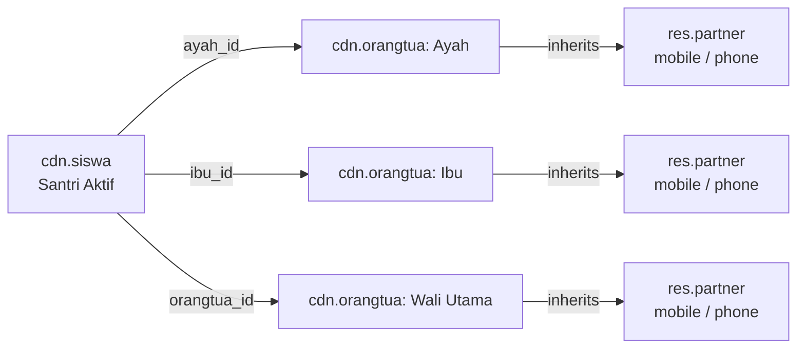
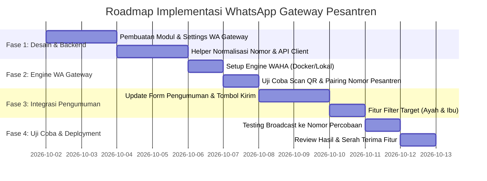

# Rencana Komprehensif Integrasi WhatsApp Gateway untuk Pengumuman & Notifikasi Pesantren (Odoo 18)

Dokumen ini memuat panduan arsitektur, pilihan teknologi (gratis vs berbayar), mitigasi risiko, struktur data, serta tahapan implementasi integrasi WhatsApp Gateway pada ekosistem **Odoo Pesantren DQI**.

---

## 1. Latar Belakang & Analisis Kebutuhan

### 1.1 Kondisi Saat Ini (Status Quo)
* Model pengumuman (`cdn.pengumuman`) saat ini hanya menyimpan data judul dan deskripsi HTML.
* Informasi pengumuman hanya muncul secara **pasif** di portal web Odoo (widget Dashboard Orang Tua & menu navbar Pengumuman).
* Orang tua/wali santri pada umumnya **tidak mengakses website setiap hari**, sehingga informasi agenda penting, libur santri, edaran pembayaran, atau pengumuman darurat berisiko terlewatkan.

### 1.2 Target Solusi
* Menyediakan mekanisme notifikasi **proaktif (Push Notification)** melalui saluran komunikasi paling efektif: **WhatsApp**.
* Pesan pengumuman dikirimkan **sekaligus ke nomor Ayah dan Ibu** santri aktif secara otomatis.
* Sistem dirancang fleksibel: dapat menggunakan opsi **100% Gratis (Self-Hosted)** atau beralih ke **Layanan Cloud (Fonnte/Wablas)** kapan saja tanpa perombakan kode.

---

## 2. Perbandingan Opsi WhatsApp Gateway

| Aspek | Opsi A: WAHA (Self-Hosted) 🏆 *Rekomendasi Hemat* | Opsi B: Fonnte / Wablas (Cloud Provider) | Opsi C: Meta Official Cloud API |
| :--- | :--- | :--- | :--- |
| **Biaya Layanan** | **Rp 0 (100% Gratis Selamanya)** | Berbayar langganan (~Rp 50.000 – Rp 100.000 / bulan) | Berbayar per percakapan (Meta Pricing ~Rp 300 - Rp 500 / percakapan) |
| **Infrastruktur** | Dijalankan sebagai container Docker di server/VPS yang sama dengan Odoo | Dikelola oleh pihak vendor (SaaS) | Dikelola oleh Meta / Business Solution Partner |
| **Kebutuhan Nomor** | Nomor WhatsApp biasa (SimCard pesantren) di-scan via QR Code | Nomor WhatsApp biasa di-scan di website vendor | Nomor khusus yang diverifikasi Meta Business Manager |
| **Batas Kuota Pesan** | **Tidak Terbatas (Unlimited)** | Sesuai paket langganan (biasanya unlimited) | Sesuai saldo deposit Meta |
| **Keamanan Data** | **Sangat Tinggi** (Nomor wali santri tidak keluar dari server sendiri) | Data kontak dikirim ke server pihak ketiga | Data aman sesuai standar Meta |
| **Kelebihan Utama** | Tidak ada biaya operasional berulang | Setup praktis tanpa perlu urus engine Docker | Aman dari pemblokiran nomor (Official) |
| **Kelemahan** | Butuh RAM kecil (~150MB) untuk Docker engine di VPS/Server | Ada ketergantungan vendor & biaya bulanan | Setup registrasi legalitas yayasan cukup ketat & berbayar per pesan |

### Rekomendasi Pemilihan:
1. **Untuk Tahap Awal & Operasional Mandiri**: Gunakan **Opsi A (WAHA - WhatsApp HTTP API)** karena 100% gratis, mudah dipasang di server Odoo, dan pesantren memiliki kendali penuh atas nomor WA dan data wali santri.
2. **Arsitektur Modul Odoo**: Modul dibuat dengan konsep **Universal Provider** (berbasis HTTP REST API). Jika di kemudian hari pesantren ingin beralih ke vendor cloud (seperti Fonnte), admin cukup mengganti URL Endpoint dan Token di menu Pengaturan Odoo.

---

## 3. Struktur Data & Mekanisme Pengambilan Nomor Kontak

### 3.1 Relasi Data di Database Odoo
Sistem akan mengambil nomor kontak orang tua dari santri aktif (`cdn.siswa`):



### 3.2 Aturan Normalisasi & Validasi Nomor
Sebelum pengiriman dieksekusi, sistem akan menjalankan filter data:
1. **Format Standar Internasional**:
   - Jika nomor diawali `08...`, otomatis diubah menjadi `628...`.
   - Menghilangkan spasi, tanda strip (`-`), titik, dan karakter non-angka.
2. **Penyaringan Nomor Ganda (Deduplication)**:
   - Jika nomor WhatsApp Ayah dan Ibu ternyata sama persis (misal memakai 1 nomor kontak keluarga), sistem hanya mengirimkan **1 pesan** agar tidak terjadi spam.
3. **Penyaringan Nomor Valid**:
   - Nomor yang kosong, kurang dari 9 digit, atau format tidak valid akan otomatis dilewati dan dicatat pada log peringatan (*warning log*).

---

## 4. Desain Fitur & Tampilan di Odoo

### 4.1 Menu Konfigurasi WA Gateway (`Settings`)
Menu konfigurasi diletakkan di bawah modul Pesantren / Pengaturan:
* **Gateway Provider**: Pilihan `WAHA (Self-Hosted)` / `Fonnte` / `Custom API`.
* **API Base URL**: Contoh: `http://localhost:3000/api/sendText` atau `https://api.fonnte.com/send`.
* **API Token / Secret Key**: Token otentikasi pengiriman pesan.
* **Session ID / Device**: Nama sesi koneksi WhatsApp (cth: `default` atau `pesantren_dqi`).
* **Delay Antar Pesan**: Waktu jeda pengiriman dalam detik (default: **3 detik**) untuk keamanan nomor dari filter spam WA.
* **Tombol Uji Koneksi**: Tombol *"Test WhatsApp Gateway"* untuk mengecek apakah status nomor sedang *CONNECTED / SCAN QR / DISCONNECTED*.

### 4.2 Pembaruan Form Pengumuman (`cdn.pengumuman`)
Form pengumuman diperkaya dengan fungsionalitas broadcasting:
* **Status Pengumuman**: `Draft` ➔ `Siap Kirim` ➔ `Terkirim (Sent)`.
* **Opsi Target Penerima**:
  - `Semua Orang Tua Santri Aktif` (Default)
  - `Filter per Jenjang / Lembaga`
  - `Filter per Kelas / Kamar Asrama`
* **Target Kontak**:
  - `Ayah dan Ibu Sekaligus` (Pilihan Utama)
  - `Hanya Ayah`
  - `Hanya Ibu`
  - `Hanya Orang Tua / Wali Utama`
* **Tombol Aksi**:
  - 🟢 **"Kirim ke WhatsApp"** (Muncul saat status Siap Kirim).
  - 🔄 **"Kirim Ulang ke Nomor Gagal"** (Jika ada nomor yang gagal terkirim).
* **Statistik & Log Pengiriman**:
  - Total Target Nomor: `...`
  - Berhasil Terkirim: `...`
  - Gagal Terkirim: `...`
  - Tanggal/Waktu Terakhir Dikirim: `...`

---

## 5. Format Pesan WhatsApp (Template Otomatis)

Karena deskripsi pengumuman di Odoo menggunakan format HTML Rich-Text, sistem akan otomatis melakukan konversi teks HTML ke format teks WhatsApp (*bold*, *italic*, bullet points):

```text
Assalamu'alaikum Warahmatullahi Wabarakatuh,
Yth. Bapak/Ibu Wali dari Ananda *{nama_santri}*,

Berikut informasi penting dari Pondok Pesantren:

📢 *{judul_pengumuman}*
📅 Tanggal: {tanggal_pengumuman}

{ringkasan_deskripsi_pengumuman}

Untuk melihat pengumuman selengkapnya, silakan kunjungi portal orang tua:
🔗 {link_portal_pesantren}

Terima kasih atas perhatian dan kerja sama Bapak/Ibu.
Wassalamu'alaikum Warahmatullahi Wabarakatuh.
_Pondok Pesantren Daarul Qur'an Indonesia_
```

---

## 6. Strategi Keamanan agar Nomor WA Tidak Diblokir (Anti-Banned)

Menggunakan nomor WhatsApp biasa untuk pengiriman massal memerlukan tata kelola yang aman agar tidak terdeteksi sebagai aktivitas spam oleh sistem kecerdasan buatan WhatsApp/Meta:

1. **Throttling & Delay Antar Pesan**:
   - Jangan mengirim 500 pesan secara serempak dalam 1 detik.
   - Sistem wajib memberi jeda 2 hingga 4 detik di antara setiap pengiriman pesan.
2. **Penyebutan Nama (Personalisasi Pesan)**:
   - Pesan yang memiliki isi berbeda (menyebut nama wali dan santri) dinilai lebih ramah dan tidak terbaca sebagai template bot kaku oleh algoritma Meta.
3. **Imbauan Simpan Kontak**:
   - Seluruh wali santri dihimbau menyimpan nomor WhatsApp resmi informasi pesantren di buku kontak HP mereka. WhatsApp sangat jarang memblokir pesan yang dikirimkan ke kontak yang saling menyimpan nomor.
4. **Waktu Pengiriman yang Sesuai**:
   - Batasi broadcast pengumuman pada jam wajar (pukul 07.30 – 20.30 WIB).

---

## 7. Roadmap & Rencana Tahapan Eksekusi



### Rincian Tiap Fase:
1. **Fase 1 (Modul Odoo)**:
   - Menambahkan menu konfigurasi gateway WhatsApp di Odoo.
   - Membuat fungsi utilitas pengiriman HTTP request dan parser nomor HP.
2. **Fase 2 (Engine WA Gateway)**:
   - Menyiapkan server WAHA (Docker) atau menggunakan akun uji coba gateway.
   - Melakukan scan QR Code dari nomor WhatsApp admin pesantren.
3. **Fase 3 (Pengumuman & Filter Target)**:
   - Menambahkan tombol "Kirim ke WhatsApp" di form pengumuman.
   - Mengambil daftar nomor Ayah & Ibu santri aktif secara dinamis.
4. **Fase 4 (Uji Coba Lapangan)**:
   - Melakukan uji coba kirim ke 2-3 nomor tim internal terlebih dahulu untuk memverifikasi kerapian pesan.
   - Mengaktifkan fitur untuk seluruh pengumuman resmi ke wali santri.

---
*Dokumen ini disusun untuk rencana pengembangan modul WhatsApp Gateway pada ekosistem Odoo Pesantren DQI.*
